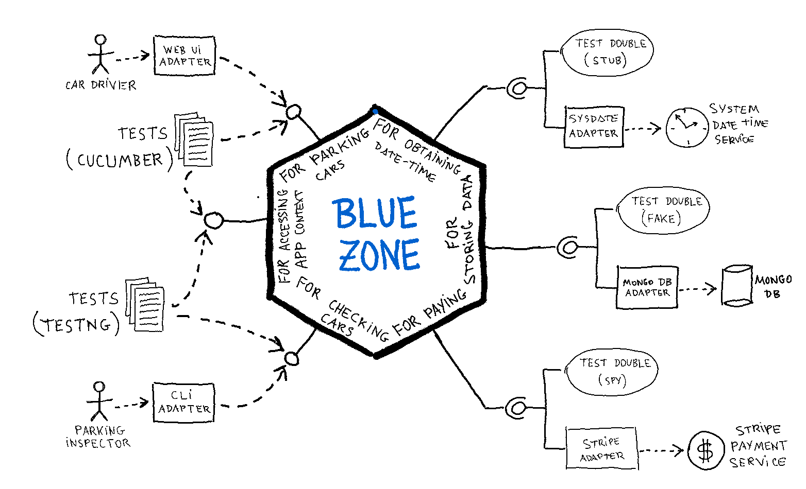

# BlueZone
## An example application implementing Hexagonal Architecture

__BlueZone__ allows car drivers to pay remotely for parking cars at regulated zones in a city, instead of paying with coins using parking meters.

- Driving actors using the application are _car drivers_ and _parking inspectors_.

  - Car drivers will access the application using a Web UI (User Interface), and they can do the following:
    
    - Ask for the available rates in the city, in order to choose the one of the zone they want to park the car at.
    - Buy a ticket for parking the car during a period of time at a regulated zone. This period starts at current date-time. The ending date-time is calculated from the paid amount, according to the rate (euros/hour) of the zone.

  - Parking inspectors will access the application using a terminal with a CLI (Command Line Interface), and they can do the following:
  
    - Check a car for issuing a fine, in case that the car is illegally parked at a zone. This will happen if there is no active ticket for the car and the rate of the zone. A ticket is active if current date-time is between the starting and ending date-time of the ticket period.
    
- Driven actors needed by the application are:

  - Repository with the data (rates and tickets) used in the application. It also has a sequence for getting ticket codes as they are needed.

  - Payment service that allows the car driver to buy tickets using a card. Obviously, no adapter for a real service has been developed, just a test-double (mock).

  - Date-time service for obtaining the current date-time when needed, for buying a ticket and for checking a car.

### Development environment:

- Java 17 (OpenJDK version 17.0.2)

- Maven 3.9.5

- IntelliJ IDEA 2023.1.5 (Community Edition)

- Ubuntu 20.04.6 LTS (Linux 5.15.0-86-generic)

### Instructions:

- Download and extract this GitHub repo to a local directory on your computer ( `<bluezone_dir>` )

- Compile all modules (you need to do this just the first time before running):

    ~~~
    cd <bluezone_dir>
    ./scripts/build.sh
    ~~~

- Select the adapters to be plugged-in at each port, editing the "ports_adapters.properties" file, located in the "<bluezone_dir>/config" directory.
 
- Initialize the driven actors as you need, editing the "driven_actors.properties" file, located in the "<bluezone_dir>/config/driven-side" directory.

- Run the driving actor you want by executing the script:

    ~~~
    cd <bluezone_dir>
    ./scripts/run_forparkingcars.sh
  ~~~

or

  ~~~
    cd <bluezone_dir>
    ./scripts/run_forissuingfines.sh
  ~~~

- If you chose to run the Web UI at the "for parking cars" port, the URL is http://localhost:8080/bluezone/